# Data structure

## Basic structure

A dataset is constructed by columns and rows, with each column as a variable and each row as an observation (person).

The **first row** always shows **variables' name**.

We have the example of the Iris dataset, you can download this dataset from Kaggle [Iris dataset](https://www.kaggle.com/datasets/uciml/iris?resource=download&select=Iris.csv). This dataset is famous among the machine learning community. It represents three different species of Iris, a type of flower. This dataset has 150 observations. Each observation is characterized by sepal length, sepal width, petal length, and petal width.

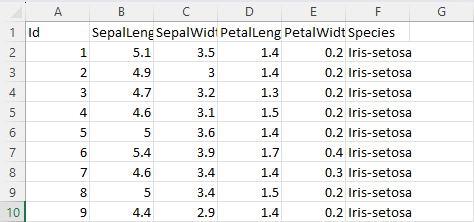

In this example, we have 6 variables in the first row, which are Id, SepalLengthCm, SepalWidthCm, PetalLengthCm, PetalWidthCm, and Species.

## Type of variables

There are different types of variables in a dataset:

**Categorical**: Variable with many options like Kinder garden, Elementary school, Junior High School, High School, College, Master, PhD for Education Status variable, etc. It's the Species variable in the Iris dataset.

**Binary**: A subset of categorical variables. Always comes with only two options like Male or Female for Sex variable, Yes or No for Having children variable, etc.

**Numeric**: Its value can be used to calculate. It's the SepalLengthCm, SepalWidthCm, PetalLengthCm, and PetalWidthCm variable in the Iris dataset. Id variable can be considered a numeric variable as well since its values are numbers, but no one uses Id to calculate.

**String**: In the string variable, the values are different combinations of words for each observation. This variable is usually the "Other please write down" variable, which are some options that researchers didn't think about when they created the data entry form. It can contain something like "Plumber" or "Air conditioner repairman" in the Job variable, which the researchers did not know what belonged to "Full-time job" or "Part-time job" options they created earlier.

**NOTE**: Some variables can be both categorical and string, like the Species variable in the Iris dataset. It has 3 options: "Iris-setosa," "Iris-versicolor," and "Iris-virginica." These options are written as strings. Sometimes you will see this type of variable in a dataset. What you need to do is change these options to numeric, then label them (labeling is optional) so that we can use them with more advanced statistical methods like regression. Not changing to numeric is fine with basic descriptive statistics, but sometimes it's not the only thing we have to do. I will discuss the way to change between variable types later in this lecture.

## Missing data

Missing data is a normal thing in raw datasets, especially when it involves a lot of observations. However, you have to make sure if a missing value is actually missing or just the value that was skipped.

# Stata overview

## Introduction

**Pros**: Stata is easy-to-learn, simple, yet powerful statistical software. Its code structure is really simple and easy to understand. With the same problem, writing code using Stata is much faster than other statistical software like R and Python (I don't know if SPSS is as simple because I don't use it). You can do every statistical calculation with ease.

**Cons**: The simplicity of the code structure has its pros but also its cons. Due to its simplicity, it has limited options to modify outputs. It can't work with multiple datasets at once or draw beautiful graphs like R, and it lacks the machine learning capability and support from the community like Python. In the end, it's not open-sourced, meaning that it has limited support from the community.

In conclusion, Stata is an introduction for beginners to statistical programs. Data scientists, biostatisticians, data enthusiasts, or just people who have more needs will seek freedom of choice from other statistical programs. However, I still use Stata in my daily work due to its fast execution and simplicity.

## Do file in Stata and the importance of it

THE FIRST RULE OF DATA ANALYSIS: **NEVER MODIFY THE DATASET BY HAND, KEEP THE ORIGINAL DATASET, IN THE ORIGINAL FORM, AT ALL COST**  

THE SECOND RULE OF DATA ANALYSIS: **ALWAYS SAVE YOUR PROGRESS USING A CODE FILE**  

THE FIRST RULE OF DATA ANALYSIS WITH STATA: **ALWAYS WRITE YOUR COMMANDS IN THE DO FILE**

Why?

- You need to save your progress.
- You need consistent results every time you need to report it.
- You need something to look back and figure out what you did.
- Science is all about reproducible results. Saving your progress using a do file is crucial. Your paper will be more trustworthy if you give the journal your do file.

Open the do file here.

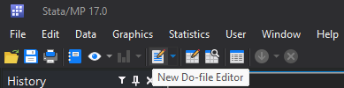

Here's the example of a do file for the Iris dataset.

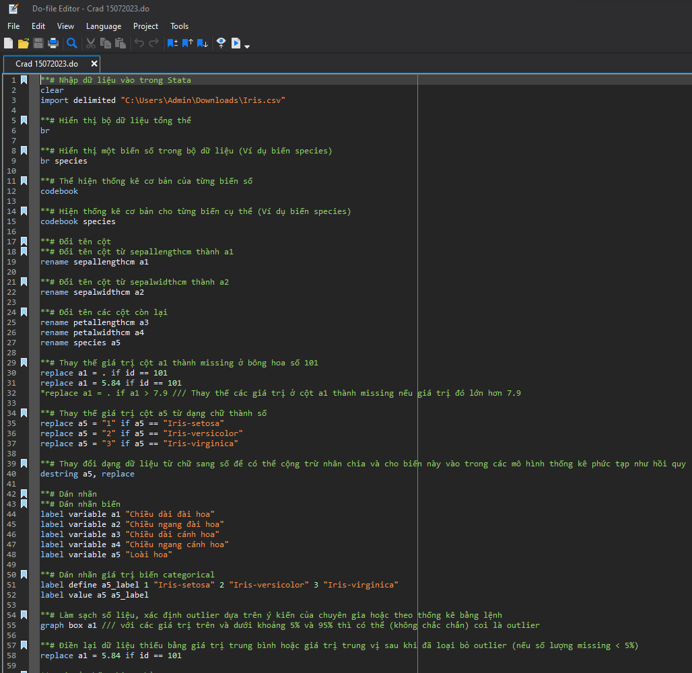

Not just Stata but all programming languages like R and Python, execute the code from top to bottom, left to right, one line by one line, so be careful when you write your code, sometimes you mess up the order.

Click execute in the do file to run the whole do fine, or blacken a line of code and click execute to run that line of code.

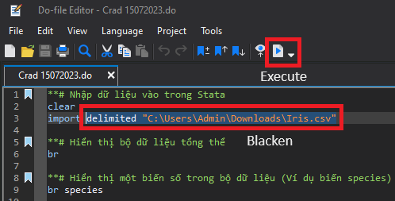

You don't need to blacken the whole line to run the whole line like other programming languages.

## Import data to Stata

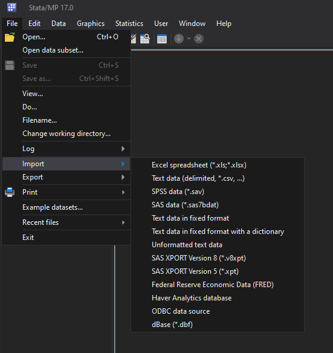

In this example, we import data from Text data, because the Iris dataset is a .csv file. 

You can also use this command

``` stata
cd "C:\Users\Admin\Downloads"
import delimited "Iris.csv", clear
```
cd command tell Stata that this is the current working directory, then the "import delimited "Iris.csv", clear" imports the dataset into data. If you don't declare the current working directory, you can use "import delimited "C:\Users\Admin\Downloads\Iris.csv", clear".

## Commands to generally describe the newly imported dataset

You can type br (browse) to see the dataset in excel-like format with rows and columns

``` stata
br
```

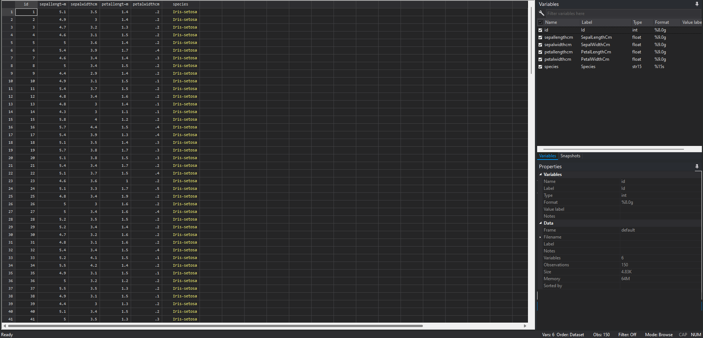

Use "br" "a specific variable" to see that variable in excel-like format

``` stata
br sepallengthcm
```

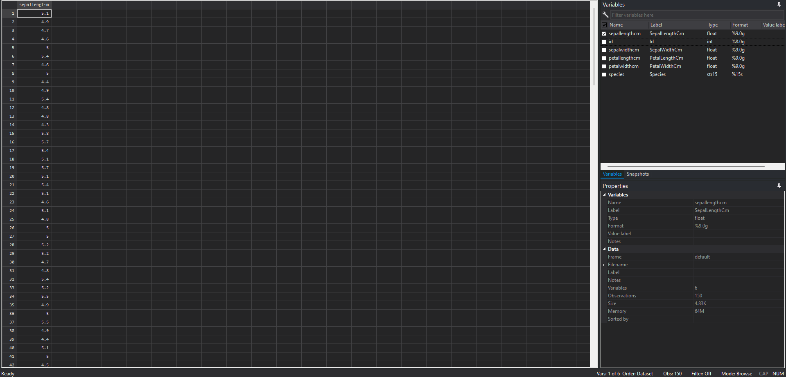

Command "d,s" gives the number of observations and the number of variables.

``` stata
d,s
```

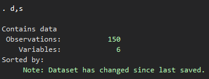

``` stata
codebook
```

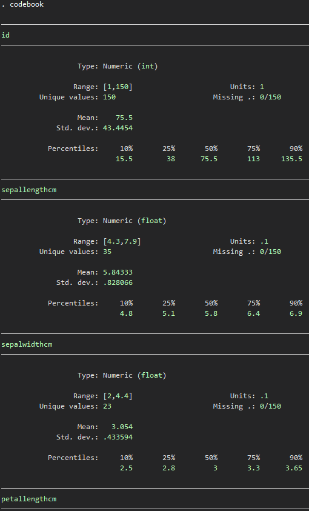

"codebook" describes all the variables of the dataset. It shows the type, range of value, number of unique values, units, number of missing values, mean, standard deviation, and inter-quantile range (percentiles). In example, the sepallengthcm variable have the range from 4.3 to 7.9, with 35 unique values, units equal 0.1, no missing values, mean equal 5.84 with a standard deviation of 0.83, the median is 5.8, the interquantile-range is 5.1 and 6.4.
You can also describe a specific variable instead of all variables using "codebook" "variable name" like this:

``` stata
codebook sepallengthcm
```

## Basic data manipulation with Stata

In Stata, as well as all other statistical software, has the ability to manipulate data in every way you can imagine, so please again, **KEEP THE ORIGINAL DATASET, NEVER EDIT IT BY HAND**, because you can do it all by using Stata's commands. When you face a problem, try to find the solution online.

### Change the name of a variable

Change the name of variable sepallengthcm to a1 so that you don't have to type a1 instead of sepallengthcm everytime you need to use it:

``` stata
rename sepallengthcm a1
```

The same for all the rest.

``` stata
rename sepalwidthcm a2
rename petallengthcm a3
rename petalwidthcm a4
rename species a5
```

### Replace a value

#### Replace a value to a new value

In example, I want to replace the value of the sepalwidthcm in the $101^\text{st}$ observation to missing, I type:

``` stata
replace a2 = . if id == 101
```

**NOTE**: In Stata, missing value for numeric variable is . (a dot) and the missing value always has the biggest value in the variable. For the string variable, missing value is displayed as a blank cell, you can write it as "" (double quote).
Always use == (equal equal) after "if", it's just how equal condition works, not only in Stata, but other software as well.
How does this command work?

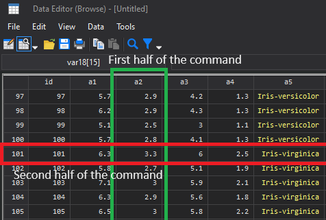

This replace command always have two parts. Basically you say that "I want to replace this" if "this condition is satisfied", pretty straight forward. The first half is related to the column when the second half related to the value in the row. Every condition works like this: the condition is always related to the value in the row, not only in Stata, but also in other software, even the IF command in Excel.
Here are some of the if qualifiers and conditions in Stata:

| Operator | Meaning                 |
| -------- | ----------------------- |
| ==       | Equal to                |
| !=       | Not equal to            |
| >        | Larger than             |
| <        | Less than               |
| >=       | Larger than or equal to |
| <=       | Less than or equal to   |
| &        | And                     |
| |        | Or                      |

#### Change the value in a range
You need to do this when you need to filter out some outliners by replacing the outliner with a missing value like the example above, but right now I want to classify all the flowers with big sepal length to Iris-versicolor.

``` stata
replace a5 = "Iris-versicolor" if a1 > 7.9 /// This is wrong in the context of having missing value
```

This will replace all value of species to Iris-versicolor if the Sepal Length of the flower is larger than 7.9. This will be very handy in the case that we want to re-classify Iris species when the sepal length is too big.

**Why is this wrong in the context of having missing value?**

As mentioned above, missing value is counted as the largest value in Stata, so the condition "if a1 > 7.9" will replace the a5 variable of all row with missing value as well, so the correct way to do this is exclude all missing value by typing:

``` stata
replace a5 = "Iris-versicolor" if a1 > 7.9 & a1 != .
```

#### Manipulate variable type from string to numeric

I also mentioned variable type, and stated that you should change the categorical string variable to categorical numeric for more advanced statistic method. Here's how you do it:

``` stata
replace a5 = "1" if a5 == "Iris-setosa"
replace a5 = "2" if a5 == "Iris-versicolor"
replace a5 = "3" if a5 == "Iris-virginica"
```

Always use "" with string variable, that's why missing string value is shown as "". 

Then destring:

``` stata
destring a5, replace
```

And you have a nice categorical numeric variable instead of a categorical string variable.

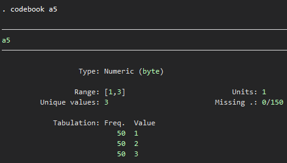

It's easy to change a variable in the opposite way, from numeric to string:

``` stata
tostring a5, replace
```

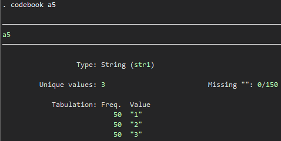

And now Stata considers this variable as a string variable, and 1, 2, 3 are just characters, string type. And of course, this string variable can't be used to calculate, because Stata no longer see these values as number. In the result and browse mode, this shows as number, but we can only know this variable type when we look at it using the codebook command. And sometimes a variable showed as string but actually it's numeric, this can be achieved using label, which will be discussed below. You will face error or wrong result when you are unaware of the variable type.

#### Changing a continuous numeric variable to a categorical variable

You will use this one in many situation when you want to classify groups of people based on their continuous numeric characteristics. In example, using BMI score to classify a person to low weight, normal or obese. In the Iris dataset, we want to classify the petal length to short, normal and long:

``` stata
gen a6 = . // Create a new variable with all missing value
replace a6 = 1 if a3 < 1.6
replace a6 = 2 if a3 >= 1.6 & a3 < 5.1
replace a6 = 3 if a3 >= 5.1
```

This will create a new variable called a6. This is the classify variable, then we assign values to this variable based on petal length. Value 1 as short, 2 as normal and 3 as long.

### Labelling a variable

We want to change the categorical string variable to categorical numeric variable for more advanced statistic. But we can replicate the original beauty of this variable instead of some boring number by using label. It's also very handy when we want to export the result to formats other than Stata.

``` stata
destring a5, replace

label variable a5 "Iris species" // Give label to the variable, can be applied for continuos variable as well

label define a5_ 1 "Iris-setosa" // Create label for value 1
label define a5_ 2 "Iris-versicolor" // Create label for value 2
label define a5_ 3 "Iris-virginica" // Create label for value 3

label value a5 a5_ // Merge the label a5_ to the variable a5
```

The whole process is like when you create a label called a5_ for the book called a5, then you stick the label a5_ to the book a5 using "label value a5 a5_":

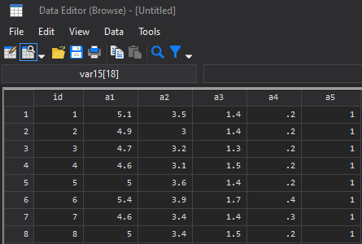

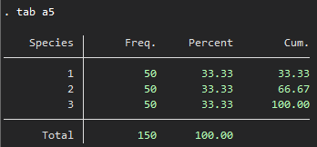

Before labelling

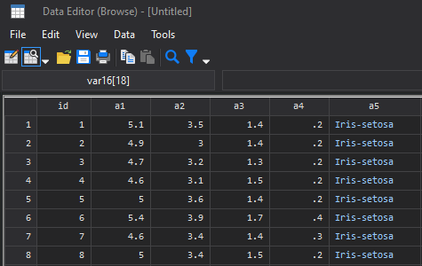

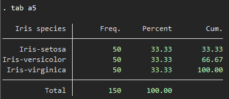

After labelling

Because we can no longer see the number by default, so we need the codebook command or nolabel option to see the number behind these labels like this:

``` stata
tab a5, nolab
```

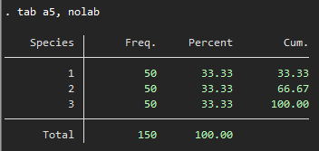

It's the same as when we had no label for this variable.