# Dataset

You can download the "Stroke Prediction Dataset" [here](https://www.kaggle.com/datasets/fedesoriano/stroke-prediction-dataset#). Remember to do the data cleaning first before analysing.

# Summary of categorical variables

## Summary one variable

Look at the gender variable:

``` stata
tab gender
```

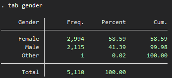

We have a total of 5110 observations who have value in the gender variable. In 5110 observation, 2994 were female, account for 58.59% of observations.

Look at the gender variable without label:

``` stata
tab gender, nolab
```

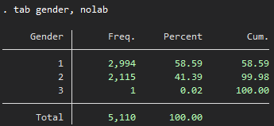

## Summary two variables

Look at the stroke by smoking status:

``` stata
tab smoking_status stroke
```

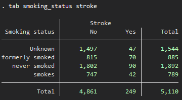

Look at the stroke by smoking status, with percentage by column:

``` stata
tab smoking_status stroke, col
```

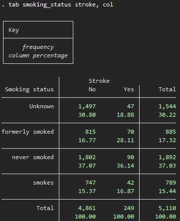

In 5110 observations, there were 249 people with stroke. Among those who had stroke, there're 47 (18.88%) with unknown smoking status, 70 (28.11%) were former smoker, 90 (36.14%) had never smoked, and 42 (16,87%) smoked.

Look at the stroke by smoking status, with percentage by row:

``` stata
tab smoking_status stroke, row
```

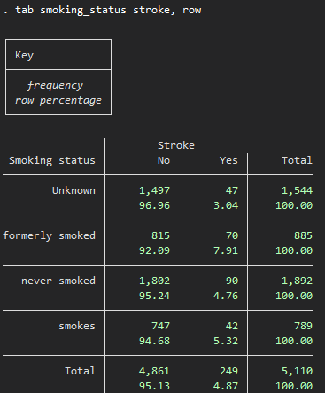

## Compare between groups of two categorical variables
### Rationale

We need to compare the different between two groups of variables. In the smoking status vs stroke example, we want to know if there're any differences in smoking status between those people who had stroke and those who did not have stroke, hence conclude that there's a relationship between smoking status and experienced stroke.

We need to conduct a statistical test to get such conclusion. For the comparison between two categorical variables, we have to choose between Chi Square test or Fisher's exact test. The Chi Square test requires sufficient amount of data to get the right result, while Fisher's exact test can endures the suffer of having a low amount of data as it's specifically designed for small sample.

We can choose which test to use by calculating the expected frequency.

### Expected frequency

Expected frequency is the number of times we would expect an event to occur over a given number of trials that take place. Expected frequency is 
calculated using this formula:

$$Expected frequency = (row sum * column sum) / table sum$$

Here we have the summary between stroke and smoking status, there're 4 groups of smoking status and 2 groups of stroke, which make up to $4 * 2 = 8$ different possibilities.

``` stata
tab smoking_status stroke, exp
```

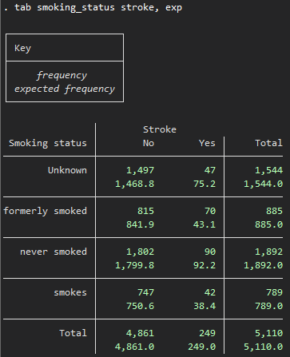

In the stroke with unknown smoking status possibility, the expected frequency were $249 * 1544 / 5110 = 75.23$, exactly what Stata is showing us.

**We use the chi square test when there're more than 20% number of possibilities have the expected frequency of more than 5 and Fisher's exact test otherwise.**

### Chi square test

The chi square test have two hypothesis:
- H0: Two possibilities occur with equal frequencies
- H1: Two possibilities occur with unequal frequencies

Chi square distribution is not a normal distribution but right-skewed. We have to compare this to the right significant value which is 0.05.

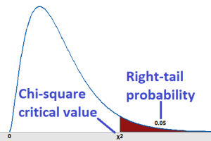

This is the formula to calculate chi square value:

$${X}_{c}^{2}=\frac{\sum(O-E)^{2}}{E}$$

In the example of stroke vs smoking status above, because there're more than 20% number of possibilities have the expected frequency of more than 5, so we use the chi square test to compare the difference in smoking status between those who had stroke and those who didn't.

$$X_{c}^{2}=\frac{(47-75.2)^{2}}{75.2}+\frac{(70-43.1)^{2}}{43.1}+\frac{(90-92.2)^{2}}{92.2}+\frac{(42-38.4)^{2}}{38.4}=27.65$$

With the $degree of freedom=(row-1)*(column-1)=(4-1)*(2-1)=3$, we translate this chi square value to p < 0.001.

Calculate using Stata:

``` stata
tab smoking_status stroke, chi2

```
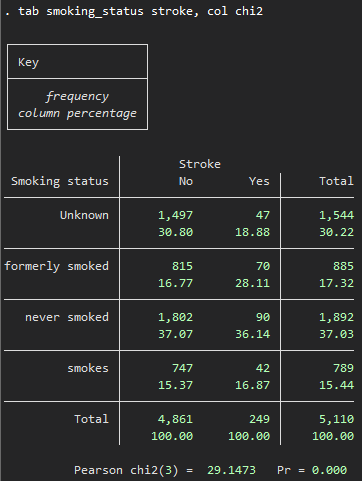

Again, the value calculated by Stata is different from what we have, equal = 29.1473, but the p-value result is still the same, p < 0.001, with 3 degree of freedom.

### Fisher's exact test

Like the chi square test, the fisher's exact test have two hypothesis:
- H0: Two possibilities occur with equal frequencies
- H1: Two possibilities occur with unequal frequencies

The Fisher's exact test is design specifically for small sample.
However, Fisher's exact test is hard to calculate by hand due to the fact that it evolves different possibilities with hypergeometric distribution.

Calculate using Stata:

``` stata
tab smoking_status stroke, exact
```

Because we shouldn't use Fisher's exact test for this smoking status vs stroke example, I use it only for the sake of syntax demonstration.

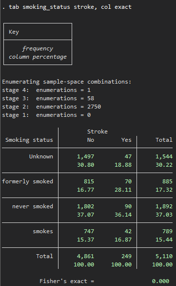

# Summary of continuous variables
## Summary one variable

``` stata
sum age
```

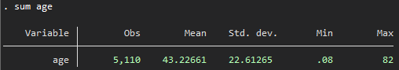

or you can use codebook

``` stata
codebook age
```

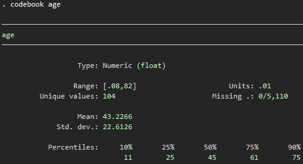

you can add ",d" after sum

``` stata
sum age, d
```

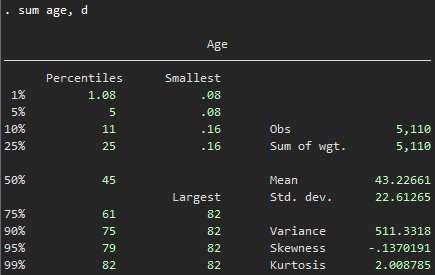

You can also specify what to see with tabstat and its suffixes

``` stata
tabstat age, stat(N mean sd min max p25 p50 p75 iqr)
```

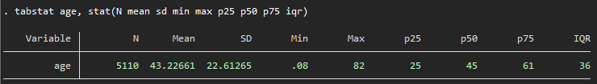

the mean age was 43.22, the standard deviation was 22.61, the min value was 0.08 which indicate a problem in the age which requires data cleaning. After cleaning, the number of people left is 4990.

## Compare one continuous variable between two groups (unpaired)

Let's compare age between two groups of stroke:

``` stata
bys stroke: sum age
```

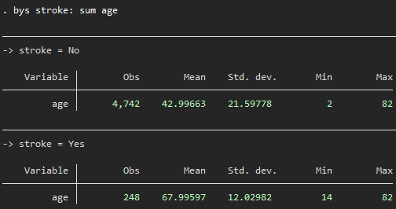

The mean age was 43.0 in the no stroke group and 68.0 in the stroke group, which mean those with higher age experienced more stroke. However, we do not know exactly if there's any real difference, so we conduct a statistical test to compare.

### Normal distribution

In order to choose the right statistical test between t-test and Mann-Whitney test, we have to know if the age variable follow the normal distribution.
The normal distribution has the bell shape as follow:

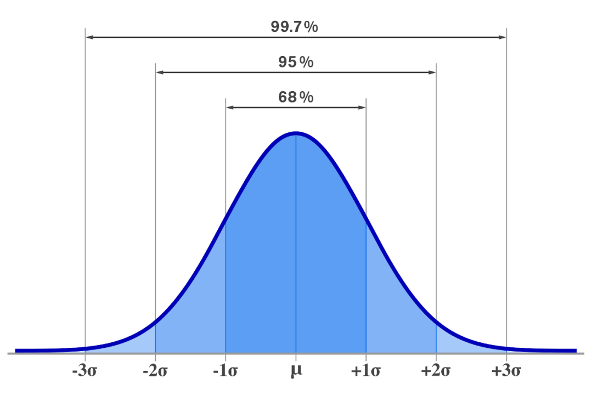

The normal distribution appear in everything in the nature without human interference. With the sufficient number of sample, we will have a normal distribution in age, height, weight,... of the whole population.

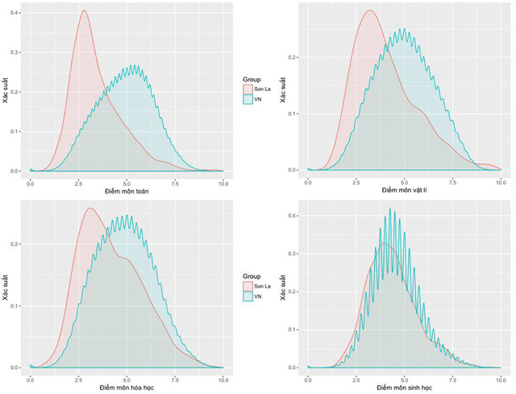

Back in 2018, professor Tuan from Gavan University used the distribution of Vietnam university admission test scores to find the abnormal score in Hoa Binh and Son La province, which lead to many high ranking person in the education system being arrested. In this example, he draw the distribution curve and find that the test score in Son La is right skewed compare to the normal distribution of the the test score in the whole Vietnam. However, the number of 9 and 10 points in math and physic in Hoa Binh and Son La accounts for a large portion of the country's number of 9 and 10 points, indicated by the higher tail in the right.

We can find if the age has normal distribution as follow:

- Draw the distribution graph:

``` stata
histogram age, normal
```

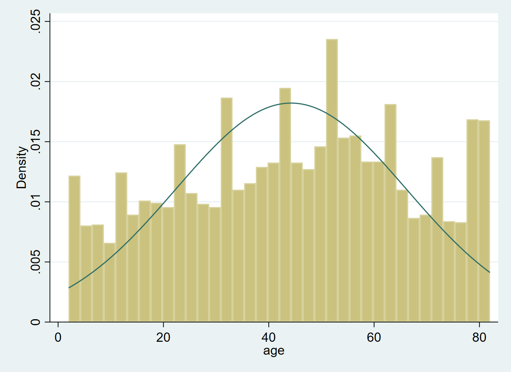

It has a bell shape.

- Compare between mean and median:

``` stata
sum age, d
```

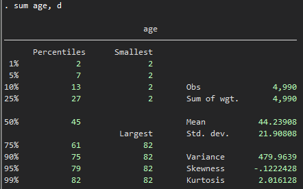

The mean is 44.2 and the median is 45, pretty close.

- Statistical test:

``` stata
sktest age
swilk age
```

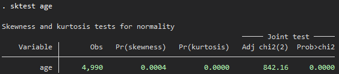

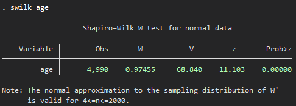

Even those the age has bell curve and near similar mean and median, both skewness-kurtosis and Shapiro-Wilk test say that the age of this sample does not follow normal distribution with p-value < 0.001.

Thus, we choose Mann-Whitney test to see if there's any difference in age between those who experienced stroke and those who did not.

### T-test

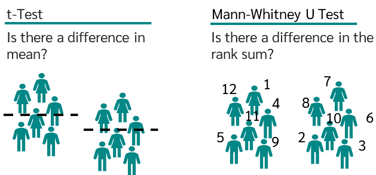

The t-test test for the difference in the mean values, while the Mann-Whitney test for the difference in the rank sum. Thus, the t-test has the following hypothesis:
- H0: There is no mean difference between the two groups in the population
- H1: There is a mean difference between the two groups in the population

There are two main types of t-tests: two-tailed and one-tailed tests. Two-tailed means that you want to compare equally, which mean you ask the question "Are the age in stroke and non-stroke equal?".

T-test value can be calculated as below:

$$t = \frac{\bar{x}_1 - \bar{x}_2}{\sqrt{{\frac{{s_1^2}}{{n_1}} + \frac{{s_2^2}}{{n_2}}}}}$$

In this formula:
- $\bar{x}_1$ and $\bar{x}_2$ are the sample means of the two groups,
- ${s}_1$ and ${s}_2$ are the sample standard deviations of the two groups,
- ${n}_1$ and ${n}_2$ are the sample sizes of the two groups,
- $t$ represents the t-statistic.

Apply this formula to our age vs stroke example, just for the sake of demonstration, we have

$$t = \frac{\bar{x}_1 - \bar{x}_2}{\sqrt{{\frac{{s_1^2}}{{n_1}} + \frac{{s_2^2}}{{n_2}}}}}=\frac{43-68}{\sqrt{{\frac{{21.6^2}}{{4742}} + \frac{{12.03^2}}{{248}}}}}=\frac{-25}{0.8254497}=−30.274$$
which translate to p < 0.001


We can run this in Stata using

``` stata
ttest age, by(stroke)
```

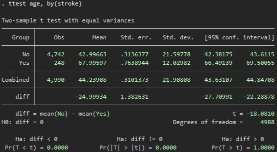

The Ha: diff != 0 represent the two-tailed t-test, the equal comparison.

So there's a different in age between those who had stroke vs those who did not, with p-value < 0.001.

### Mann-Whitney test

It has another name, the Wilcoxon's sign-rank test. 

The Mann-Whitney test has the following hypothesis:
- H0: There is no difference (in terms of central tendency) between the two groups in the population.
- H1: There is a difference (with respect to the central tendency) between the two groups in the population.

Now, the same as Fisher's exact test, the Mann-Whitney test is also hard to calculate by hand because we have to rank every observations in the dataset, so I only show you the syntax and it's result.

``` stata
ranksum age, by(stroke)
```

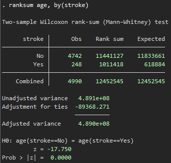

The p-value is less than 0.001, thus we also conclude that there's a different in age between those who had stroke vs those who did not, with p-value < 0.001.