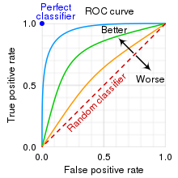
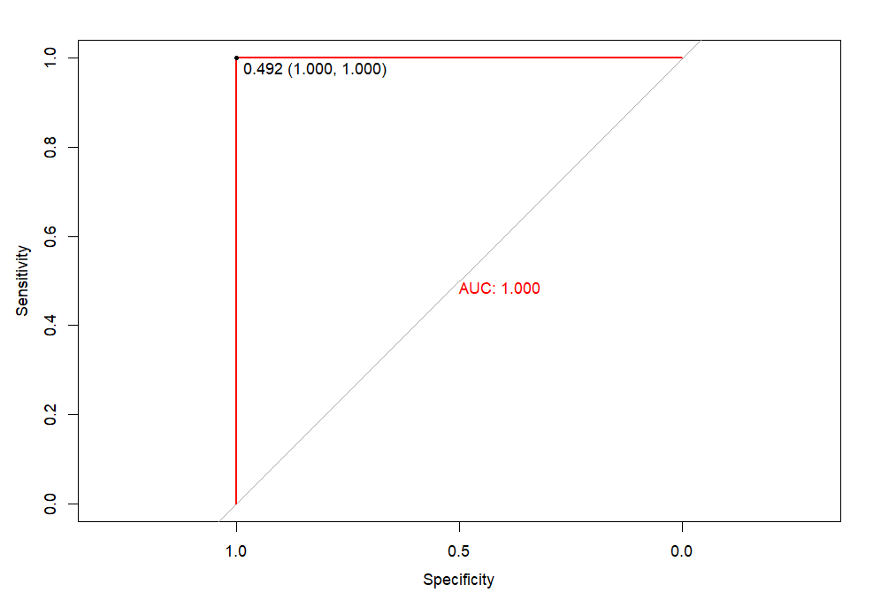
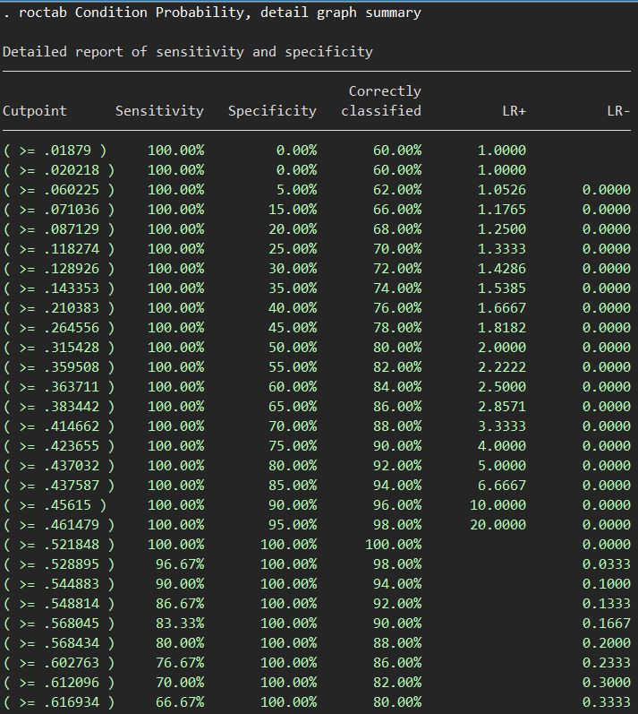

# Development History

The ROC curve was first used during World War II to analyze radar signals. After the Pearl Harbor attack in 1941, the U.S. military began research to improve the accuracy of predicting Japanese aircraft from radar signals. This led to the measurement of the radar's prediction capability, hence the name Receiver Operating Characteristic (ROC).

# 2x2 Table and Basic Formulas

Below is a 2x2 table illustrating the results generated by a certain method (e.g., a COVID test showing positive or negative results, or a mathematical model predicting high or low risk of Down syndrome) compared to their actual outcomes (e.g., a PCR-confirmed COVID case or actual birth of a baby with Down syndrome).

|                  | **Predicted Positive (PP)** | **Predicted Negative (PN)** |
|------------------|---------------------------|----------------------------|
| **Positive (P)** | True positive (TP)        | False negative (FN)        |
| **Negative (N)** | False positive (FP)       | True negative (TN)         |

From this 2x2 table, we derive the following formulas:

$$\text{Prevalence} = \frac{P}{P + N}$$

$$\text{True Positive Rate (Sensitivity)} = \frac{TP}{P}$$

$$\text{True Negative Rate (Specificity)} = \frac{TN}{N}$$

$$\text{Accuracy} = \frac{TP + TN}{P + N}$$

$$\text{False Positive Rate} = \frac{FP}{N}$$

$$\text{False Negative Rate} = \frac{FN}{P}$$

$$\text{Positive Predictive Value} = \frac{TP}{PP}$$

$$\text{Negative Predictive Value} = \frac{TN}{PN}$$

# ROC Curve

## Concept

A threshold is necessary to classify individuals into high or low blood sugar groups, or to determine whether a probability derived from a prediction model is high or low. Without a benchmark, it's unclear how severe a percentage value is. For instance, if told that a loved one has a 90% mortality rate, the absence of information on the prediction's accuracy might lead to misinformed decisions. Conversely, if the mortality rate is 10% but the accuracy is low, one might underestimate the severity and fail to act appropriately.

The ROC curve is plotted using the True Positive Rate (Sensitivity) and the True Negative Rate (Specificity). The graph below illustrates that the more the curve bends toward the top-left corner, the more accurate the prediction model. At the extreme top-left corner lies the optimal model with 100% sensitivity, 100% specificity, and thus 100% accuracy.

Each point on the curve represents a different cut-off threshold. The ideal cut-off is at the top-left corner, where sensitivity and specificity are highest.



## Calculating the ROC
Given the following dataset, we use the ROC to determine the optimal cut-off threshold for predicting whether a condition belongs to group 1 or 0.

| Probability | Condition |
| :---------: | :-------: |
|  0.548814   |     1     |
|  0.715189   |     1     |
|  0.602763   |     1     |
|  0.544883   |     1     |
|  0.423655   |     0     |
|  0.645894   |     1     |
|  0.437587   |     0     |
|  0.891773   |     1     |
|  0.963663   |     1     |
|  0.383442   |     0     |
|  0.791725   |     1     |
|  0.528895   |     1     |
|  0.568045   |     1     |
|  0.925597   |     1     |
|  0.0710361  |     0     |
|  0.0871293  |     0     |
|  0.0202184  |     0     |
|   0.83262   |     1     |
|  0.778157   |     1     |
|  0.870012   |     1     |
|  0.978618   |     1     |
|  0.799159   |     1     |
|  0.461479   |     0     |
|  0.780529   |     1     |
|  0.118274   |     0     |
|  0.639921   |     1     |
|  0.143353   |     0     |
|  0.944669   |     1     |
|  0.521848   |     1     |
|  0.414662   |     0     |
|  0.264556   |     0     |
|  0.774234   |     1     |
|   0.45615   |     0     |
|  0.568434   |     1     |
|  0.0187902  |     0     |
|  0.617635   |     1     |
|  0.612096   |     1     |
|  0.616934   |     1     |
|  0.943748   |     1     |
|   0.68182   |     1     |
|  0.359508   |     0     |
|  0.437032   |     0     |
|  0.697631   |     1     |
|  0.0602255  |     0     |
|  0.666767   |     1     |
|  0.670638   |     1     |
|  0.210383   |     0     |
|  0.128926   |     0     |
|  0.315428   |     0     |
|  0.363711   |     0     |

Use the calculation formula to calculate the sensitivity and specificity for each point. For example, with a cut-off point of 0.4, we have the following results, with 1 being the value representing high risk and 0 being the value representing low risk.

| Probability | Condition | Predicted_Condition |
|:--------------:|:------------:|:----------------------:|
| 0.548814 | 1 | 1 |
| 0.715189 | 1 | 1 |
| 0.602763 | 1 | 1 |
| 0.544883 | 1 | 1 |
| 0.423655 | 0 | 1 |
| 0.645894 | 1 | 1 |
| 0.437587 | 0 | 1 |
| 0.891773 | 1 | 1 |
| 0.963663 | 1 | 1 |
| 0.383442 | 0 | 0 |
| 0.791725 | 1 | 1 |
| 0.528895 | 1 | 1 |
| 0.568045 | 1 | 1 |
| 0.925597 | 1 | 1 |
| 0.0710361 | 0 | 0 |
| 0.0871293 | 0 | 0 |
| 0.0202184 | 0 | 0 |
| 0.83262 | 1 | 1 |
| 0.778157 | 1 | 1 |
| 0.870012 | 1 | 1 |
| 0.978618 | 1 | 1 |
| 0.799159 | 1 | 1 |
| 0.461479 | 0 | 1 |
| 0.780529 | 1 | 1 |
| 0.118274 | 0 | 0 |
| 0.639921 | 1 | 1 |
| 0.143353 | 0 | 0 |
| 0.944669 | 1 | 1 |
| 0.521848 | 1 | 1 |
| 0.414662 | 0 | 1 |
| 0.264556 | 0 | 0 |
| 0.774234 | 1 | 1 |
| 0.45615 | 0 | 1 |
| 0.568434 | 1 | 1 |
| 0.0187898 | 0 | 0 |
| 0.617635 | 1 | 1 |
| 0.612096 | 1 | 1 |
| 0.616934 | 1 | 1 |
| 0.943748 | 1 | 1 |
| 0.68182 | 1 | 1 |
| 0.359508 | 0 | 0 |
| 0.437032 | 0 | 1 |
| 0.697631 | 1 | 1 |
| 0.0602255 | 0 | 0 |
| 0.666767 | 1 | 1 |
| 0.670638 | 1 | 1 |
| 0.210383 | 0 | 0 |
| 0.128926 | 0 | 0 |
| 0.315428 | 0 | 0 |
| 0.363711 | 0 | 0 |

In the first case, the ratio is 0.54, with a cut-off of 0.4, meaning this ratio is higher than 0.4, so the predicted value is concluded to be 1, and vice versa for ratios lower than 0.4, the predicted value is concluded to be 0. From this, we have the following 2x2 table after comparing the predicted value with the actual value, the horizontal row is the predicted value and the vertical column is the actual value.

| Actual/Predicted | 0 | 1 | All |
|:-------|:---:|:---:|:----:|
| 0 | 14 | 6 | 20 |
| 1 | 0 | 30 | 30 |
| All | 14 | 36 | 50 |

From this 2x2 table, we see that at a cut-off threshold of 0.4, there are 14/50 cases that correctly predict the negative status, 30/50 cases that correctly predict the positive status, and 6/50 cases that are predicted as positive but the result is negative. Applying the formula for calculating sensitivity, specificity, and accuracy to this result, we have:

$$\text{Sensitivity(Độ nhạy)} = \frac{30}{30} = 100\%$$

$$\text{Specificity(Độ đặc hiệu)} = \frac{14}{20} = 70\%$$

$$\text{Accuracy(Độ chính xác)} = \frac{30 + 14}{30 + 20} = \frac{44}{50} = 88\%$$

So with a cut-off threshold of 0.4, we have a sensitivity of 100%, a specificity of 70%, and an accuracy of 88%. Therefore, for each cut-off point of the ROC, we have a different sensitivity and specificity, from this sensitivity and specificity we plot a point on the Oxy graph of the ROC curve diagram. The set of plotted points of the cut-off points connected together will draw the ROC curve.

In Stata, we perform ROC curve analysis using the following command:

```stata
roctab Condition Probability, detail graph summary
```

with roctab being the command, Condition being the "Condition" variable in the table above, Probability being the Probability variable in the table above, detail to draw a table showing the cutoff points, graph to draw the graph, summary to conclude the number of participants, AUC.

With R, we can use the pROC package with the following command

``` r
library(pROC)
roc_model <- roc(data$Condition, data$Probability)
plot <- plot.roc(roc_model, col = "#FF0000", print.auc = TRUE, of="thresholds", thresholds="best", print.thres="best")
```

with the data set named data, Condition being the Condition variable in the table above, Probability being the Probability variable in the table above, the roc command to determine the roc model, plot.roc to draw the ROC diagram, col = "#FF0000" to specify red for the ROC, print.auc = TRUE to write the AUC value on the chart, the command group of="thresholds", thresholds="best", print.thres="best" to determine the cut-off point with the best sensitivity and specificity and represent it on the chart.



Determining the cut-off point with the best sensitivity and specificity
Above, we used a command to determine the cut-off point with the best sensitivity and specificity, but how do we manually determine this cut-off point? Below is the table showing the sensitivity and specificity of each cut-off point on Stata.



We see that at each cut-off point, as specificity increases, sensitivity decreases and vice versa, this is perfectly consistent with the ROC diagram, where the points at the bottom have 0% sensitivity and 100% specificity, at the top corner, the sensitivity is 100% and the specificity is 0%. Therefore, a point with both high sensitivity and specificity, its cut-off value must be in the middle of the observed value range.

There are many methods to determine the cut-off point, but the popular method and the usual choice of statistical packages such as pROC on R is the Youden method (Youden's J statistic). This method determines the best cut-off point using the following formula:

$$J = Sensitivity + Specificity - 1$$

Simply put, this method calculates the sum of sensitivity and specificity for various cut-off points. The cut-off point with the highest J value is considered the best cut-off point.

Although we can determine the best cut-off point from the Stata results table as 0.52—because both sensitivity and specificity are 100%—in most cases, the results are not so clear, and it is necessary to find the best cut-off point using this Youden method.

So why does the best cut-off point result in Stata differ from the best cut-off point result in R? Both results are correct, which is why it is important to specify the statistical software used when explaining the calculation process. The reason for the discrepancy lies in the dataset, which contains only 50 cases. As a result, the gaps between the proportion values are significant. For instance, there is a gap between 0.49 (from R) and 0.52 (from Stata). No proportion values exist between 0.49 and 0.52 that yield different results in the Condition column.

# Conclusion
The ROC method is commonly used in classification problems, regardless of what is being classified. Therefore, it is applied across various fields that require distinguishing one group from another.