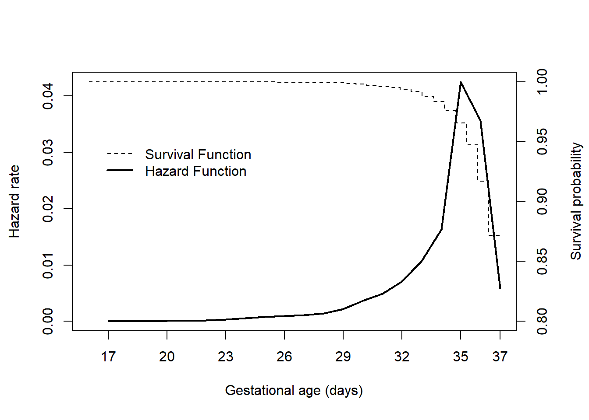
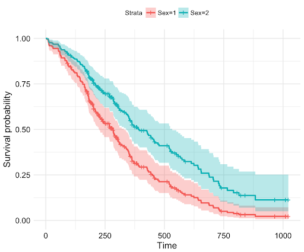
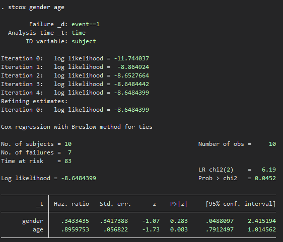
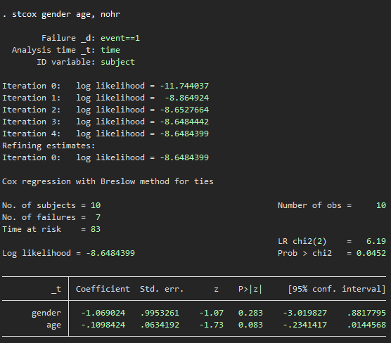
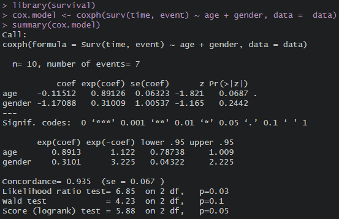

# The Hazard Function
- Think about fitting a regression model to survival data
- We wish to predict the true survival time $T$. Since the observed quantity $Y =min(T,C)$ is positive and may have a long right tail, we might be tempted to fit a linear regression of $log(Y)$ on $X$. But censoring again creates a problem.
- To overcome this difficulty, we instead make use of a sequential construction, similar to the idea used for the Kaplan-Meier survival curve.
- The hazard function or hazard rate, also known as the force of mortality, is formally defined as:

$$
h(t) = \lim_{\Delta t \to 0} \frac{\Pr(t < T \leq t + \Delta t | T > t)}{\Delta t} = \frac{f(t)}{S(t)}
$$

where $T$ is the (true) survival time. **It is the death rate in the instant after time $t$, given survival up to that time**.
- The hazard function is the basis for the Proportional Hazards Model.



## Survival vs Hazard Function

### Example 1

Imagine you have a new type of light bulb that has an unknown lifespan. You want to understand two things: the probability that the light bulb will last a certain amount of time without failing (the survival function), and the risk of the light bulb failing at any specific moment given that it has lasted until that moment (the hazard function).

**Survival Function ($S(t)$):** Think of the survival function as a gauge of the light bulb's lifespan. It starts at 100% when the light bulb is new, which means it's certain that it hasn't failed up to the moment you turned it on. As time goes on, this percentage decreases because the likelihood of the bulb still being in working order drops. If, after 1,000 hours, the survival function value is 90%, you would say that there's a 90% chance a bulb will last at least 1,000 hours.

**Hazard Function ($h(t)$):** Now for the hazard function, imagine you're observing the light bulb at a specific moment, say at the 1,000-hour mark. The hazard function tells you the risk of the bulb failing in the very next moment, given that it has lasted for 1,000 hours so far. This risk could be very small if the bulb is of high quality, or it could be increasing if the bulb is approaching the end of its typical lifespan.

**In Common Sense Terms:**
- The survival function is like the "big picture" view, showing you the overall likelihood of the bulb still shining as time goes on.
- The hazard function is like a "zoomed-in" view at a specific moment, examining the immediate risk of failure at that particular time.

**Example:**

- If you have a batch of 100 light bulbs, and your study shows that after 1,000 hours (which is the time $t$), 90 bulbs are still working, the survival function $S(1000)$ would be 0.9 or 90%.

- If the hazard function $h(1000)$ is very low, let's say 0.01 at the 1,000-hour mark, it means that there is a 1% risk that any given bulb that has lasted until 1,000 hours will fail in the next hour.

### Example 2

We have this dataset:

| subject | time | event | gender    |
| ------- | ---- | ----- | --- |
| 1       | 3    | 0     |  1  |
| 2       | 5    | 1     |  2  |
| 3       | 7    | 1     |  2  |
| 4       | 2    | 1     |  1  |
| 5       | 18   | 0     |  2  |
| 6       | 16   | 1     |  2  |
| 7       | 2    | 1     |  1  |
| 8       | 9    | 1     |  1  |
| 9       | 16   | 1     |  2  |
| 10      | 5    | 0     |  2  |

The hazard rate would be calculated like this:

| Time | Events | At Risk | Hazard Rate |
|------|--------|---------|-------------|
| 2    | 2      | 10      | 0.200       |
| 5    | 1      | 7       | 0.142857    |
| 7    | 1      | 5       | 0.200       |
| 9    | 1      | 4       | 0.250       |
| 16   | 2      | 3       | 0.666667    |

# The Proportional Hazards Model

## Concept

- The **proportional hazards assumption** states that:

$$
h(t | x_i) = h_0(t) \exp \left( \sum_{j=1}^{p} x_{ij}\beta_j \right)
$$

where $h_0(t) \geq 0$ is an unspecified function, known as the **baseline hazard**, $i$ represents the patient at $i_(th)$ position , and $j$ represents the feature (covariate, variable). It is the hazard function for an individual with features $x_{i1} = \ldots = x_{ip} = 0$.

- The name **proportional hazards** arises from the fact that the hazard function for an individual with feature vector $x_i$ is some unknown function $h_0(t)$ times the factor $\exp\left( \sum_{j=1}^{p} x_{ij}\beta_j \right)$. The quantity $\exp\left( \sum_{j=1}^{p} x_{ij}\beta_j \right)$ is called the **relative risk** for the feature vector $x_i = (x_{i1}, \ldots, x_{ip})$, relative to that for the feature vector $x_i = (0, \ldots, 0)$.

- **This model shows the probability of one person dying relative to another person at any given time points $t$**. We can see that's this model does not depend on time $t$ in the formula.



## Cox regression model
- Cox regression is a specific type of proportional hazards model developed by David Cox in 1972.
- It is widely used in survival analysis. 
- It allows researchers to assess the association between one or more covariates and the hazard of an event while adjusting for other covariates. 
- Cox regression does not require assumptions about the shape of the baseline hazard function, making it particularly flexible. 
- **It estimates hazard ratios for each covariate, indicating the relative change in the hazard of the event associated with a one-unit change in the covariate, while holding other covariates constant**.
- The equation of Cox regression model is as follow:
$$ h(t|X) = h_0(t) \cdot \exp(\beta_1 X_1 + \beta_2 X_2 + \ldots + \beta_p X_p) $$
Where:
- $h(t|X)$ is the hazard function at time $t$ for an individual with covariate values $X$.
- $h_0(t)$ is the baseline hazard function, representing the hazard function for an individual with all covariates set to 0.
- $\beta_1, \beta_2, ..., \beta_p$ are the coefficients associated with each predictor variable $X_1, X_2, ..., X_p$, representing the log hazard ratio or log relative risk for each unit increase in the predictor variable.
- $X_1, X_2, ..., X_p$ are the values of the predictor variables for the individual.
- **A key assumption of the Cox model is that the hazard curves for the groups of observations (or patients) should be proportional and cannot cross.**
- Consider two patients k and k' that differ in their x-values. The corresponding hazard function can be simply written as follow:

Hazard function for the patient k:

$h_k(t) = h_0(t) \exp\left(\sum_{i=1}^{n} \beta_i x_{ik}\right)$

Hazard function for the patient k':
  
$h_{k'}(t) = h_0(t) \exp\left(\sum_{i=1}^{n} \beta_i x_{ik'}\right)$

The hazard ratio for these two patients is:

$\frac{h_k(t)}{h_{k'}(t)} = \frac{h_0(t) \exp\left(\sum_{i=1}^{n} \beta_i x_{ik}\right)}{h_0(t) \exp\left(\sum_{i=1}^{n} \beta_i x_{ik'}\right)} = \frac{\exp\left(\sum_{i=1}^{n} \beta_i x_{ik}\right)}{\exp\left(\sum_{i=1}^{n} \beta_i x_{ik'}\right)} = \exp\left(\sum_{i=1}^{n} \beta_i (x_{ik} - x_{ik'})\right)$

which is **independent of time t**.

## Compute Cox regression model

We have this dataset:

| subject | time | event | gender | age |
|---------|------|-------|--------|-----|
| 1       | 3    | 0     | 1      | 45  |
| 2       | 5    | 1     | 2      | 32  |
| 3       | 7    | 1     | 2      | 57  |
| 4       | 2    | 1     | 1      | 41  |
| 5       | 18   | 0     | 2      | 68  |
| 6       | 16   | 1     | 2      | 52  |
| 7       | 2    | 1     | 1      | 39  |
| 8       | 9    | 1     | 1      | 47  |
| 9       | 16   | 1     | 2      | 61  |
| 10      | 5    | 0     | 2      | 35  |

We want to compute the Cox regression model with covariate gender and age, as gender = 1 is male and gender = 2 is female.

### Stata

```stata
stset time, id(subject) failure(event==1)
stcox gender age
```



or

```stata
stset time, id(subject) failure(event==1)
stcox gender age, nohr
```



- The parameter estimates represent the increase in the expected log of the relative hazard for each one unit increase in the predictor, holding other predictors constant. There is a 0.896 unit increase in the expected log of the relative hazard for each one year increase in age, holding sex constant, and a 0.343 unit increase in expected log of the relative hazard for women as compared to men, holding age constant, at any given time point. Note that $e^{-1.07} = 0.343$ and $e^{-0.11} = 0.896$

- For instance, for a female (assuming gender = 1 is male and gender = 2 is female) aged 45, the hazard would be calculated as:
$$ℎ(t∣gender=female,age=45)=h0(t)exp(βgender×1+βage×45)=h0(t)*exp(-1.07×1+(-0.11×45))=h0(t)*0.343*0.896^{45}=h0(t)*0.00245$$
- The interpretation is: "For a 45-year-old female, the hazard of the event occurring at any time $t$ is 0.00245 times that of an individual with the baseline covariates, given the model and the data."

### R

```R
library(survival)
cox.model <- coxph(Surv(time, event) ~ age + gender, data =  data)
summary(cox.model)
```

