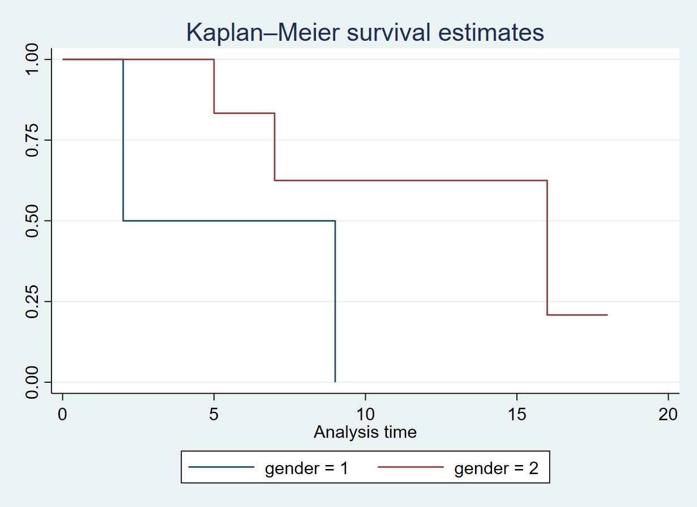
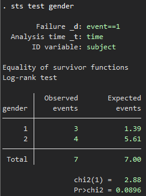
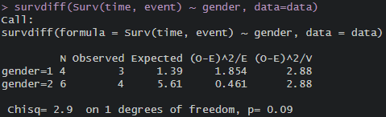

# Log-Rank Test (By Nathan Mantel and William Haenszel)



- We wish to compare the survival of males to that of females.
- Is there a significant difference between the two curves? In other words, does gender have an effect on the survival time?
- At first glance, a two-sample t-test seems like an obvious choice: but the presence of censoring again creates a complication.
- To overcome this challenge, we will conduct a log-rank test with the following hypothesis:
	+ H0: $S_1(t)=S_2(t)$ for all time t
	+ H1: $S_1(t) \neq S_2(t)$ for some time t
	
# Assumptions for the Log Rank Test

- **Independence:** The survival times or event times of individuals in each group should be independent to each other. This assumption implies that the occurrence of an event (e.g., death or failure) for one individual should not influence the occurrence of an event for another individual.

- **Non-Informative Censoring:** Censoring should not be related to the event being studied or to the group assignment (Censored and non-censored patients do not differ in terms of their actual event times). The log-rank test assumes that the probability of censoring should be the same for all individuals within each group. In other words, censoring should not be related to the event being studied or to the group assignment.

- **Proportional Hazards:** The hazard rates (the risk of an event occurring) for the compared groups should be consistent over time. The ratio of the hazard rates should remain constant, indicating that the groups are not experiencing significantly different risks at different time points.

# Calculating the Log Rank Test

## Calculate by hand

We have this dataset:

| subject | time | event | gender |
| ------- | ---- | ----- | ------ |
| 1       | 3    | 0     | 1      |
| 2       | 5    | 1     | 2      |
| 3       | 7    | 1     | 2      |
| 4       | 2    | 1     | 1      |
| 5       | 18   | 0     | 2      |
| 6       | 16   | 1     | 2      |
| 7       | 2    | 1     | 1      |
| 8       | 9    | 1     | 1      |
| 9       | 16   | 1     | 2      |
| 10      | 5    | 0     | 2      |

We can rewrite this dataset as follow with (1) as gender = 1 and (2) as gender = 2:

|   time | Events(1) | Censored(1) | Number(1) | Events(2) | Censored(2) | Number(2) |
|-------:|-----:|-----:|-----:|-----:|-----:|-----:|
|      2 |    2 |    0 |    4 |    0 |    0 |    6 |
|      3 |    0 |    1 |    2 |    0 |    0 |    6 |
|      5 |    0 |    0 |    1 |    1 |    1 |    6 |
|      7 |    0 |    0 |    1 |    1 |    0 |    4 |
|      9 |    1 |    0 |    1 |    0 |    0 |    3 |
|     16 |    0 |    0 |    0 |    2 |    0 |    3 |
|     18 |    0 |    0 |    0 |    0 |    1 |    1 |

Rewrite column's name for better calculation:

| time |  e1 |  c1 |  n1 |  e2 |  c2 |  n2 |
| ---: | --: | --: | --: | --: | --: | --: |
|    2 |   2 |   0 |   4 |   0 |   0 |   6 |
|    3 |   0 |   1 |   2 |   0 |   0 |   6 |
|    5 |   0 |   0 |   1 |   1 |   1 |   6 |
|    7 |   0 |   0 |   1 |   1 |   0 |   4 |
|    9 |   1 |   0 |   1 |   0 |   0 |   3 |
|   16 |   0 |   0 |   0 |   2 |   0 |   3 |
|   18 |   0 |   0 |   0 |   0 |   1 |   1 |

We then calculate the expected value for each time point using this formula:

$$exp_1 = \left( \frac{n_1}{n_1 + n_2} \right) \cdot (e_1 + e_2)$$

$$exp_2 = \left( \frac{n_2}{n_1 + n_2} \right) \cdot (e_1 + e_2)$$

Apply that to our dataset:

|   time | e1 | c1 | n1 | e2 | c2 | n2 | exp1 | exp2
|-------:|-----:|-----:|-----:|-----:|-----:|-----:|-----:|-----:|
|      2 |    2 |    0 |    4 |    0 |    0 |    6 |   0.8|   1.2|
|      3 |    0 |    1 |    2 |    0 |    0 |    6 |   0|   0|
|      5 |    0 |    0 |    1 |    1 |    1 |    6 |   0.14|   0.86|
|      7 |    0 |    0 |    1 |    1 |    0 |    4 |   0.2|   0.8|
|      9 |    1 |    0 |    1 |    0 |    0 |    3 |   0.25|  0.75|
|     16 |    0 |    0 |    0 |    2 |    0 |    3 |   0|   2|
|     18 |    0 |    0 |    0 |    0 |    1 |    1 |   0|   0|

The log-rank stat is calculated using this formula:

$$\text{Log Rank stats} = \frac{(O_2 - E_2)^2}{\text{Variance}(O_2 - E_2)}$$

The $O_2 - E_2$ is the total of observed - expected number of event between two groups at all time point while for the denominator which is the variance, we have this formula:

$$\text{Var}(O_2 - E_2) = \sum \frac{n_1n_2(e_1 + e_2)(n_1 + n_2 - e_1 - e_2)}{(n_1 + n_2)^2(n_1 + n_2 - 1)}$$

Apply it to our data

|   time | e1 | c1 | n1 | e2 | c2 | n2 | exp1 | exp2 | e1 - exp1 | e2 - exp2 | Var
|-------:|-----:|-----:|-----:|-----:|-----:|-----:|-----:|-----:|-----:|-----:|-----:|
|      2 |    2 |    0 |    4 |    0 |    0 |    6 |   0.8|   1.2|   1.2|   -1.2|   0.43|
|      3 |    0 |    1 |    2 |    0 |    0 |    6 |   0|   0|   0|   0|   0|
|      5 |    0 |    0 |    1 |    1 |    1 |    6 |   0.14|   0.86|  -0.14|   0.14|   0.12|
|      7 |    0 |    0 |    1 |    1 |    0 |    4 |   0.2|   0.8|  -0.2|   0.2|   0.16|
|      9 |    1 |    0 |    1 |    0 |    0 |    3 |   0|   0.75|   0.75|   -0.75|   0.19|
|     16 |    0 |    0 |    0 |    2 |    0 |    3 |   0|   2|   0|   0|   0|
|     18 |    0 |    0 |    0 |    0 |    1 |    1 |   0|   0|   0|   0|   0|

We have the total of observed - expected number of event at all time point of group 1 is 1.61 while this value of group 2 is -1.61. The variance is 0.9. And the log-rank statistic is

$$\text{Log Rank stats} = \frac{(O_2 - E_2)^2}{\text{Variance}(O_2 - E_2)} = \frac{(1.61)^2}{0.9} = 2.88$$

With the degree of freedom is 1, we have the p-value = 0.0897.

## Calculate using Stata

First we have to declare this dataset as a survival-time dataset using:

```stata
stset time, id(subject) failure(event==1)
```

Then we calculate the test using:

```stata
sts test gender
```



## Calculate using R

We can use the following codes to get the summary of data:

```r
library(survival)
km <- survfit(Surv(time, event) ~ 1, data = data)
summary(km)
```

Then the log-rank test can be calculated using this command:

```r
survdiff(Surv(time, event) ~ gender, data=data)
```



## Conclusion
With the p-value of 0.0897, we conclude that we failed to reject the null hypothesis that there's no difference between the two Kaplan-Meier curves.