# Definition
- Survival analysis concerns a special kind of outcome variable: the time until an event occurs.
- Sounds like a regression problem. But there is an important complication: some of the patients have survived until the end of the study. Such a patient's survival time is said to be censored.
- While the event of interest is often death (in this case we study the time to death for patients having a specific disease) or recurrence (in this case we study the time to relapse of a certain disease), it is not limited to the medical field or epidemiology.

In fact, it can be used in many domains. For example, we may also analyze the time until a person:

- Getting cured from a certain disease.

- Finding a new job after a period of unemployment.

- Being arrested again after having been released from jail.

- The first pregnancy.

- The failure of a mechanical system or a machine.

- A bank or a company goes bankrupt.

- A customer buys a new product or stops its current subscription.

- A letter is delivered.

- A taxi picks you up after having called the taxi company.

- An employee leaves the company.

# Why do we need special methods for survival analysis?

- **Duration times** are **always positive**: the time until an event of interest occurs cannot be less than 0. Moreover, the distribution of survival times is right-skewed.

- **Different measures** are of interest depending on the research question, context, etc. For instance, we could be interested in:
    + The **probability** that a cancer patient survives longer than 5 years after diagnosis?
    + The typical **waiting time** for a cab to arrive after having called the taxi company?
    + **How many**, out of 100 unemployed people, are expected to have a job again after 2 months of unemployment?

- **Censoring** is almost always an issue because:
    + When the event occurred before the end of the study, the survival time is known.
    + However, sometimes, the event is not yet observed at the end of the study. Suppose that we study the time until death of patients with breast cancer. Luckily, some patients will not die before the end of the study.
    + It can also happen that the patient withdraws from the study or moves to another country before the end of the study (known as lost to follow up or drop out).
    + In all situations, his or her survival time cannot be observed because the event is not observed for the duration of the study.
    + Censoring can be seen, in some sense, as a type of missing data.
    + For these reasons, many “standard” statistical tools such as descriptive statistics, hypothesis tests and regression models are not appropriate for this kind of data. Specific statistical methods are required to take into account the fact that the exact survival duration for some patients is missing. It is known that they survived a certain amount of time (until the end of the study or until the time of withdrawal), but their exact survival time is unknown.

There are three types of censoring:

1. Right-censoring (the most frequent): Right censoring occurs when the event of interest has not occurred by the end of the study period or when an individual drops out of the study before the event occurs. This is the most common type of censoring in survival analysis. For instance, if the event is death, right censoring happens if a person is still alive when the study ends.

2. Left-censoring (the least frequent): Left censoring happens when an individual has already experienced the event by the time the observation begins. For example, if you're studying the time to infection after exposure to a certain bacteria, left censoring would occur if some subjects were already infected at the time they were recruited into the study.

3. Interval-censoring: Interval censoring occurs when the event is known to have happened in a certain interval but not the exact time. This type of censoring is common in medical follow-ups where check-ups occur at specific intervals. If a patient is found to have developed a disease between two visits, but the exact time of disease onset is unknown, the data are interval censored.

# Survival and Censoring Times

- For each individual, we suppose that there's a true failure or event time T, as well as a true censoring time C.

- The survival time represents the time at which the event of interest occurs (such as death).

- By contrast, the censoring is the time at which censoring occurs: for example, the time at which the patient drops out of the study or the study ends.

- We observe either the survival time T or else the censoring time C. Specifically, we observe the random variable $$Y = min(T,C)$$.

If the event occurs before censoring (i.e. T < C) then we observe the true survival time T; if censoring occurs before the event (T > C) then we observe the censoring time. We also observe a status indicator,

$$
\delta = \begin{cases} 
1 & \text{if } T \leq C \\
0 & \text{if } T > C 
\end{cases}
$$

# A closer look at Censoring

- Suppose that a number of patients drop out of a cancer study early because they are very sick.

- An analysis that does not take into consideration the reason why the patients dropped out will likely overestimate the true average survival time.

- Similarly, suppose that males who are very sick are more likely to drop out of the study than females who are very sick. Then a comparison of male and female survival times may wrongly suggest that males survive longer than females.

- In general, we need to assume that, conditional on the features, the event time T is independent of the censoring time C.

# The survival curve (By Edward Kaplan and Paul Meier)

- The survival function (or curve) is defined as $$S(t) = Pr(T > t)$$This decreasing function quantifies the probability of surviving **past** time $t$, or the probability that the event has not occurred by time $t$. It's a cumulative measure from the start of observation up to time $t$.

- For example, suppose that a company is interested in modeling customer churn. Let T represent the time that a customer cancels a subscription to the company’s service.

- Then S(t) represents the probability that a customer cancels later than time t. The larger the value of S(t), the less likely that the customer will cancel before time t.

- If you have $S(t)=0.8$ at time $t = 5$, this means there is an 80% probability of surviving (or not experiencing the event) up until time 5.

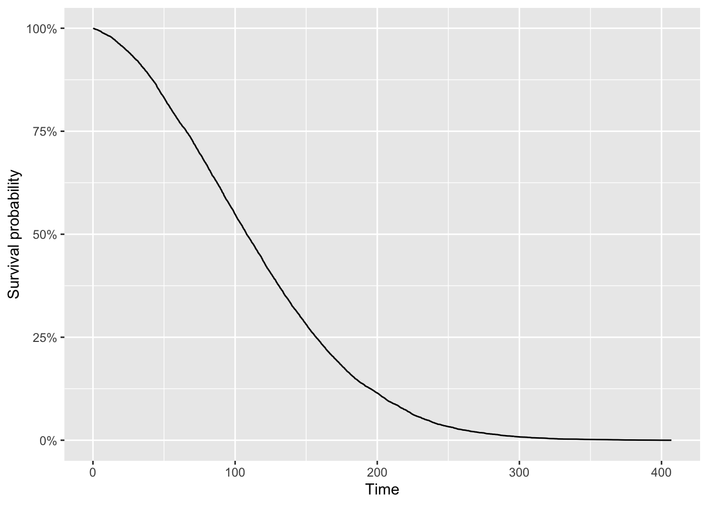

## First example

### First failure

Yellow dots represent dead, while blue dots represent censor

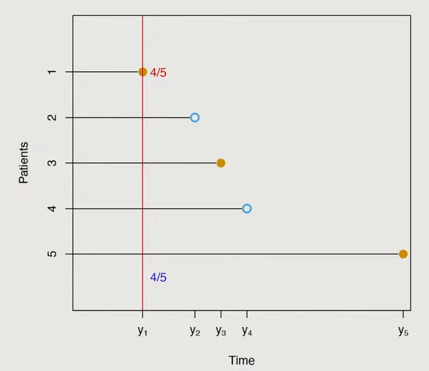

### Second failure

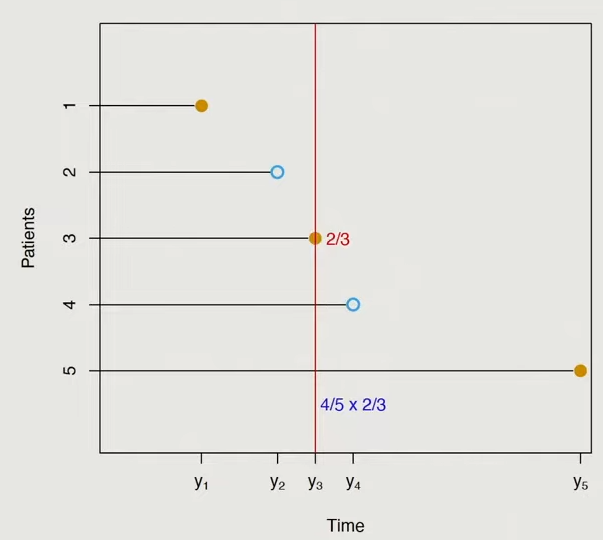

### Third failure

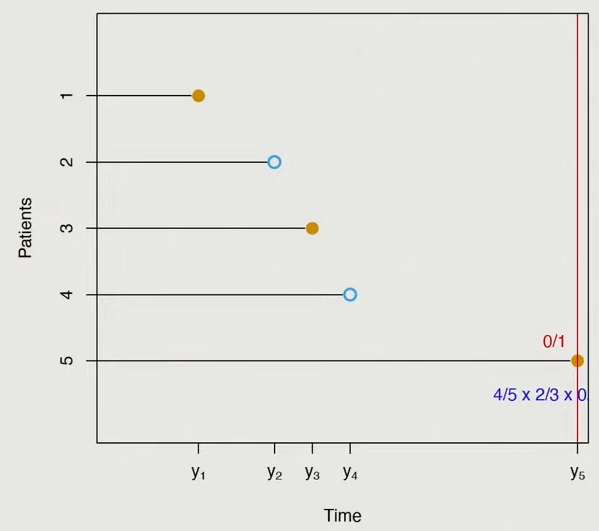

### Kaplan-Meier survival curve

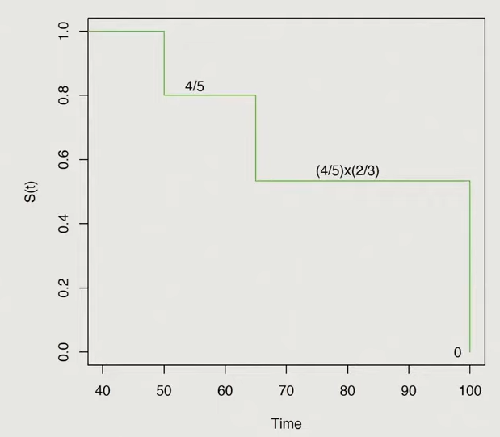

## Second example

### Dataset

| subject | time | event | gender |
| ------- | ---- | ----- | ------ |
| 1       | 3    | 0     | 1      |
| 2       | 5    | 1     | 2      |
| 3       | 7    | 1     | 2      |
| 4       | 2    | 1     | 1      |
| 5       | 18   | 0     | 2      |
| 6       | 16   | 1     | 2      |
| 7       | 2    | 1     | 1      |
| 8       | 9    | 1     | 1      |
| 9       | 16   | 1     | 2      |
| 10      | 5    | 0     | 2      |

where:

- `subject` is the individual’s identifier.
- `time` is the time to event (in years).
- `event` is the event status (0 = censored, 1 = event happened).

Remember that for each subject, we need to know at least 2 pieces of information:

1. The time until the event of interest or the time until the censoring.

2. Whether we have observed the event of interest or if we have observed censoring.

We first need to count the number of distinct event times. Ignoring censored observations, we have 5 distinct event times: 2, 5, 6, 9, 16

The easiest way to do the calculation by hand is by filling the following table (a table with 5 rows since there are 5 distinct event times):

| $j$   | $y(j)$ | $d(j)$ | $R(j)$ | $1 - \frac{d(j)}{R(j)}$ |
| --- | ---- | ---- | ---- | ------------- |
| 1   |      |      |      |               |
| 2   |      |      |      |               |
| 3   |      |      |      |               |
| 4   |      |      |      |               |
| 5   |      |      |      |               |

We fill columns one by one:

- $y(j)$ = the ordered distinct event times: 2, 5, 7, 9 and 16

So the table becomes:

| $j$   | $y(j)$ | $d(j)$ | $R(j)$ | $1 - \frac{d(j)}{R(j)}$ |
| --- | ---- | ---- | ---- | ------------- |
| 1   |  2   |      |      |               |
| 2   |  5   |      |      |               |
| 3   |  7   |      |      |               |
| 4   |  9   |      |      |               |
| 5   |  16  |      |      |               |

- $d(j)$ = the number of observations for each distinct event time. For this, the frequency for each distinct event time is useful are:

```
## time
##  2  5  7  9 16 
##  2  1  1  1  2
```

The table becomes:

| $j$   | $y(j)$ | $d(j)$ | $R(j)$ | $1 - \frac{d(j)}{R(j)}$ |
| --- | ---- | ---- | ---- | ------------- |
| 1   |  2   |  2   |      |               |
| 2   |  5   |  1   |      |               |
| 3   |  7   |  1   |      |               |
| 4   |  9   |  1   |      |               |
| 5   |  16  |  2   |      |               |

- $R(j)$ = the remaining number of individuals at risk. For this, the distribution of time (censored and not censored) is useful are:

```
## time
##  2  3  5  7  9 16 18 
##  2  1  2  1  1  2  1
```

We see that:

- At the beginning there are 10 subjects
- Just before time $t = 5$, there are 7 subjects left (10 subjects - 2 who had the event - 1 who is censored)
- Just before time $t = 7$, there are 5 subjects left (= 10 - 2 - 1 - 2)
- Just before time $t = 9$, there are 4 subjects left (= 10 - 2 - 1 - 2 - 1)
- Just before time $t = 16$, there are 3 subjects left (= 10 - 2 - 1 - 2 - 1 - 1)

The table becomes:

| $j$   | $y(j)$ | $d(j)$ | $R(j)$ | $1 - \frac{d(j)}{R(j)}$ |
| --- | ---- | ---- | ---- | ------------- |
| 1   |  2   |  2   |  10  |               |
| 2   |  5   |  1   |  7   |               |
| 3   |  7   |  1   |  5   |               |
| 4   |  9   |  1   |  4   |               |
| 5   |  16  |  2   |  3   |               |

- $1 - d(j)/R(j)$ is straightforward, so the table becomes:

| $j$   | $y(j)$ | $d(j)$ | $R(j)$ | $1 - \frac{d(j)}{R(j)}$ |
|-----|------|------|------|----------------|
| 1.00| 2.00 | 2.00 | 10.00| 0.80           |
| 2.00| 5.00 | 1.00 | 7.00 | 0.86           |
| 3.00| 7.00 | 1.00 | 5.00 | 0.80           |
| 4.00| 9.00 | 1.00 | 4.00 | 0.75           |
| 5.00| 16.00| 2.00 | 3.00 | 0.33           |

The Kaplan-Meier estimator is:

$$
\hat{S}_{KM}(t) = \prod_{j:y(j) \leq t} \left(1 - \frac{d(j)}{R(j)}\right)
$$

For each $j$, we thus take the cumulative product:

- $j1$ = 0.8 * 1 = 0.8
- $j2$ = 0.8 * 0.86 = 0.6856
- $j3$ = 0.6856 * 0.80 = 0.54848
- $j4$ = 0.54848 * 0.75 = 0.41136
- $j5$ = 0.41136 * 0.33 = 0.1369829

So finally, we have the survival probabilities (rounded to 3 digits):

| $j$   | $1 - \frac{d(j)}{R(j)}$ | $\hat{S}_{KM}(t)$ |
|-----|--------------------------|-------------------|
| 1.00 | 0.80                     | 0.80              |
| 2.00 | 0.86                     | 0.69              |
| 3.00 | 0.80                     | 0.55              |
| 4.00 | 0.75                     | 0.41              |
| 5.00 | 0.33                     | 0.14              |

We can now represent graphically the Kaplan-Meier estimator:


# Example with Stata

## Declare survival-time dataset

First we have to declare this dataset as a survival-time dataset using:

```stata
stset time, id(subject) failure(event==1)
```

- `time` as variable time.
- `subject` as variable subject (only need this if you have multiple instances of a subject).
- `event` as variable event that define the event, we define the event as 1 here.

## Calculate the life table as above

```stata
ltable time event
```

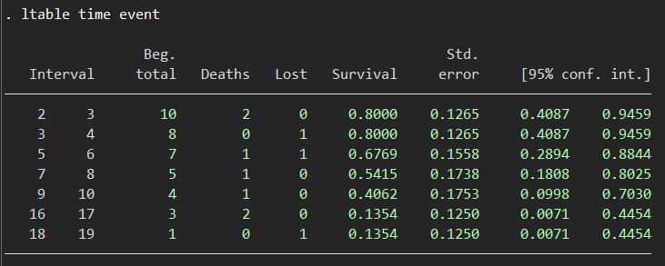

We can see that the result here is basically the same as above.

Calculate by 2 groups of gender:

```stata
ltable time event, by(gender)
```

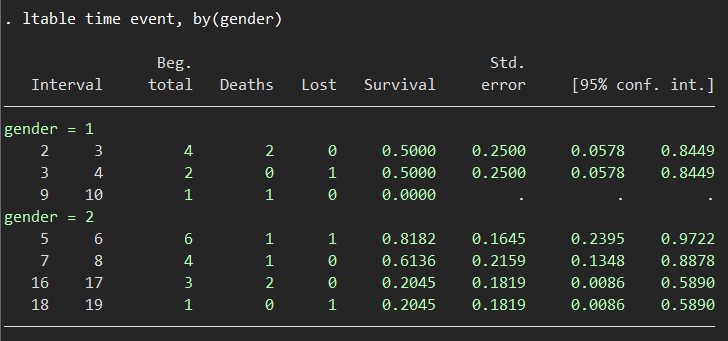

## Draw the Kaplan-Meier survival curve

```stata
sts graph, by(gender)
```


# Example with R

## Total

We can use the following codes to get the summary of data:

```r
library(survival)
km <- survfit(Surv(time, event) ~ 1, data = data)
summary(km)
```

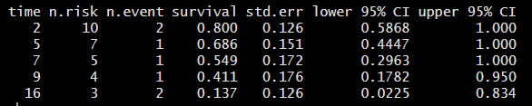

Then we draw the Kaplan-Meier survival curve:

```r
plot(km,
     xlab = "Time",
     ylab = "Survival probability",
     conf.int = FALSE
)
```

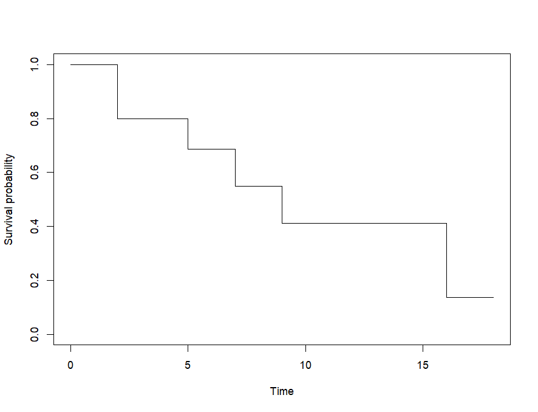

## By gender

Summary:

```r
library(survival)
km <- survfit(Surv(time, event) ~ gender, data = data)
summary(km)
```

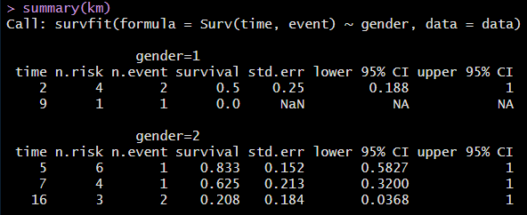

Kaplan-Meier survival curve:

```r
plot(km,
     xlab = "Time",
     ylab = "Survival probability",
     col = c("blue", "red"), # Assuming you have two genders
     lty = 1:2 # Different line types for each gender
)
```

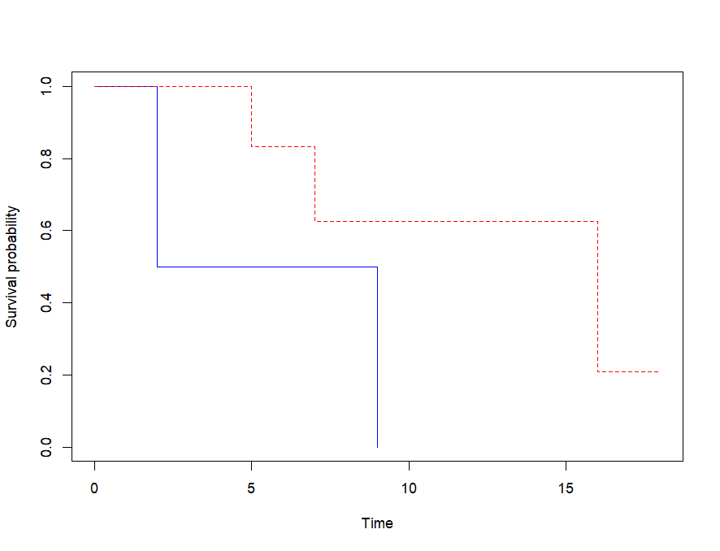